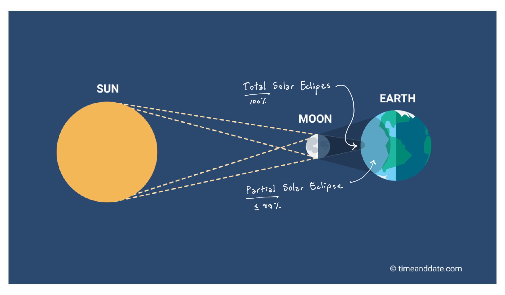

# Midnight at Noon
> _It is a spectacle pure and simple, the most magnificent free show that nature presents to man. Not to view the coming one would be to literally lose the opportunity of a lifetime._ --New York Times, 1925
## What is a Total Solar Eclipse?
A total eclipse occurs when the Moon "totally" blocks the Sun, i.e., when it blocks 100% of the sun's light. This is a rare and special event that you do not want to miss!
The next one in the US will be in [2044/45](https://www.timeanddate.com/eclipse/list.html?starty=2040).

The image below is a good representation of what a total solar eclipse looks like with the naked eye.

## Watch Out for Bad Reporting

News organizations typically do a TERRIBLE job covering this. Here are a couple myths and important clarifications:

***“My house is in the path of a 95% eclipse; that’s good enough for me.”***
This thinking has a critical flaw: it assumes that a 95% eclipse is 95% as cool as a total 100% eclipse. That's just not the case. A 95% eclipse may be cool, but a 100% eclipse is mind blowing.

***“But I was told not to look directly at the sun.”***
Correct, don't look directly at the exposed Sun. Eclipse glasses are for partial eclipses only--when the sun is partially exposed. BUT, during *totality* (when the moon totally blocks all the light from the sun), *TAKE YOUR GLASSES OFF AND LOOK DIRECTLY AT IT*! You can and must look directly at the eclipse to see the magic (explained below). You do not need eclipse glasses during totality.

I had some people tell me after the 2017 eclipse: "The News told me not to look at it so I kept my eclipse glasses on the whole time." They missed the whole show! Don't be that guy.

Note, however, that it's important to stop looking as soon as the total eclipse is over. You can find the exact times of totality for your location in the References below. Also, check out [NASA's eye-safety info](https://solarsystem.nasa.gov/eclipses/safety/).

## The Magic of a Total Solar Eclipse
***“What is this magic you speak of? What’s the big deal?”***
The universe can seem kinda lame because most of the time we don’t notice it; things in astronomy tend to look super small, super faint, or happen super slowly.  But a total solar eclipse is an opportunity to see the universe “in action" and to play a part in a surreal, sublime scene in a real-life sci-fi movie.

Here’s a play by play of the experience:

***An hour before the eclipse*** you don't notice any difference. You look at the sun through a solar filter and pinhole projection and see that the moon is indeed making its way across. It looks cool, but you know more is coming...

***About 2-10 minutes before totality***, things start looking weird. It's getting darker. You feel like you have sepia filters over your eyes. Contrast lessens. Someone is closing the window blinds...

***About 0-2 minutes before totality***, the sky starts to transition from twilight to dark. Stars and constellations shine. Planets, too, like Mercury and Venus. Birds, confused, start chirping their morning and evening songs. The warmth from the sun fades away. You feel like something big is about to happen.

***Then, TOTALITY***. The Moon and Sun combine and suddenly you are thrust into night. You are teleported away from daylight and blue sky and dropped onto what feels like a different planet. You look up and see an ominous black orb suspended in the sky. The blackness of the orb feels blacker than the sky because it is surrounded by a whispy, bright white halo with tendrils that stretch out so far to make the Sun/Moon appear four times their normal size. Eerily, it looks just like an eyeball. You have never felt more small or humbled. Some of the people around you (ones that seemed reserved leading up to the eclipse) seem to make primal yelps. Your friend next to you (the one that doesn't believe in God) says "Oh my God." You feel frozen but you're shaking. You're not sure how to react so you yell out with everyone else. You lose all sense of your modern self; genes buried deep inside you from a million years ago reactivate and you devolve back into a Homo Erectus, confused and yelling at the sky.

You spot little bits of red and pink along the edges of the Sun/Moon: these are solar prominences which are more fully appreciated through a pair of binoculars or telescope. You pull up your binoculars and you're blown away by the details you're seeing, just right there, with your own eyes. You're used to the Sun being a featureless, bright flashlight, one that you never look at directly, but now you've been given the opportunity to glimpse behind the curtain and see just how dynamic and active it is. That whispy halo is the Sun's corona; it contains ripples in a pond of light which fades off to infinity where the light from other stars take over. All along the perimeter of the Sun/Moon, you see the prominences. They're deep and bright, red and pink. Some appear as spots between lunar mountains while others make grand arcs following local trails of magnetism. Each prominence is different. Some are concentrated, like a necklace of beads, while others are like miniature whisps the size of Earth.

At your location, totality lasts for four minutes, an amount of time that feels forever during the event but a blink afterward.

Suddenly, the Moon's shadow retreats and you are thrown back into daylight. It feels as if you've just been jolted awake from a deep, immersive dream where you were part of some ancient Aztec ritual. Now you find yourself standing under the lamp of the Sun, bemused, as if naked in a hospital hallway with no memory of how you got there. Like the child from that viral video you think "Is this real life?" You spend the next six years pondering that, until the next total eclipse teases the opportunity to find out.

# Planning
The total eclipse is totally worth seeing but there are some challenges you may encounter. Below I provide some info and tools to help you overcome some potential challenges and make it easier to plan your trip.

for example, if you're staying in san antonio and then you see bad weather approachig you might consider driving a few hours away for better ewather. 

## Date and Time
The eclipse will take place on **April 8, 2024**. Depending on your location, it will start anywhere from 1:30pm to 3:30pm (local time). To accurately see when the eclipse will start and end in your area, use this map at [TimeandDate.com](https://www.timeanddate.com/eclipse/map/2024-april-8). Clicking on the map will show all the time data for that particular location.

## Where To See It?

[Click here to access the Google Map shown above.](https://www.google.com/maps/d/u/0/edit?mid=1CrZe36J2R3DhytDIHm_NAVMw6dC-qf8&usp=sharing)

### The Path of Totality
The total eclipse will be viewable in a path from **Texas to Maine**. The "path of totality" is shown in the Google Map above; this is the area where you can see a 100% total eclipse. If you are outside of this path you will not see the total eclipse. **You must be inside this path.**

- **Centerline of the Path**: The thick black line is the centerline of the path. Along this line, the total eclipse will last up to 4.5 minutes.
- **Outside Edge of the Path**: The two thin black lines are the outside edge of totality--the further away from the centerline you are, the shorter the eclipse will last. If you were to stand right along the edge you would only see 1 second of totality! **You want to be as close to the centerline of the path as possible.**

### Weather
The most important aspect of the weather in regards to eclipse planning is **cloud cover**. The map above was made based on historic weather data and shows where you may have the best chances for clear skies.

- "**Green**" = Best chance for clear skies. These areas include southern Texas and the southern shore of Lake Erie. (Texas is the better bet but a "lake effect" can sometimes clear the skies along Lake Erie).
- "**Yellow**" = Pretty good chance for clear skies. This includes northeast Texas, Arkansas, and western New York.
- "**Orange**" = 50/50 chance for clear skies. This includes Missouri, Illinois, Indiana, and Ohio. Probably not worth traveling to these places unless you happen to live there or have family there you could visit.
- "**Red**" = Minimal chance for clear skies. Northern New York, Vermont, New Hampshire, and Maine are historically very cloudy this time of year. Much higher risk of missing the eclipse in these areas.

There's no controlling the weather, but you can skirt around it if need be. The best thing is to have a car so that, day of, you can change to a more favorable location a few hours away if need be.

### Trip Planning Checklist & Considerations
- [ ] **Be mobile.** Have a car (either drive your own or rent one) in case you need to move out of the way of a weather system. Back in 2017, an entire football stadium of observers missed out when a cloud passed in front of the eclipse.
- [ ] **Book sooner rather than later.** Hotels and AirBnBs along the eclipse path are already booking up (some are already 4x their normal price). Most of America will be wanting to see this and if even a tenth of those people show up that's a lot of folks within a sliver of shadow.
- [ ] **Have a backup plan.** If the weather is looking bad for your location A, you can pivot to location B instead.
- [ ] **Have good hourly weather data.** Consider subscribing to a weather service like [Windy.com](www.windy.com) which will show you precise cloud-cover data and forecasts.

# References
- General info: https://www.mreclipse.com/Totality2017/Totality2017-Ch11.html
- "Sun, Moon, Earth" book by Tyler Nordgren: https://www.hachettebookgroup.com/titles/tyler-%20%20nordgren/sun-moon-earth/9780465060924/
- Historic weather info: https://eclipsophile.com/2024tse/
- Exact timing based on location: https://www.timeanddate.com/eclipse/map/2024-april-8
- Viewing safety: https://solarsystem.nasa.gov/eclipses/safety/

